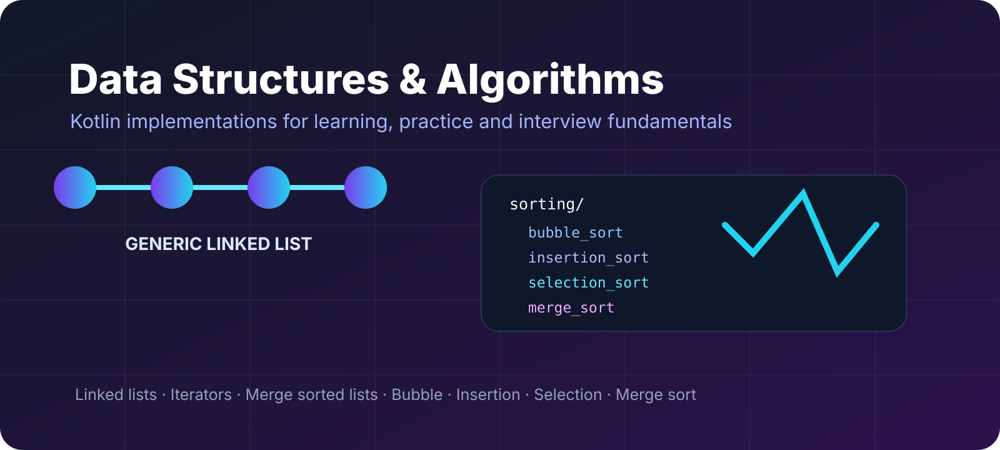

<p align="center"></p>

# Data Structures and Algorithms in Kotlin

A compact Kotlin learning repository that implements core data structures and sorting algorithms from scratch. The project focuses on understanding how the structures work internally rather than relying only on Kotlin's standard library.

## What is included

### Linked list
The repository contains a generic singly linked list backed by a custom `Node<T>` type. It implements `MutableCollection<T>`, provides a custom mutable iterator, and supports:

- push and append
- insertion after a node
- indexed node lookup
- pop and remove-last operations
- remove-after
- clear, add, addAll, remove, removeAll and retainAll
- contains / containsAll
- forward iteration
- iterative reversal
- recursive reverse printing
- middle-node lookup using slow/fast pointers
- merging two sorted linked lists

There is also a small file of LeetCode-oriented linked-list solutions and examples.

### Sorting algorithms

| Algorithm | Implementation | Typical time |
| --- | --- | --- |
| Bubble sort | in-place extension on `MutableList<T>` | O(n²) |
| Insertion sort | in-place extension | O(n²) |
| Selection sort | in-place extension | O(n²) |
| Merge sort | recursive divide-and-merge | O(n log n) |

A reusable `swapAt` extension is shared by the in-place algorithms.

## Project structure

```
src/main/kotlin/
├── linkedList/
│   ├── Node.kt
│   ├── LinkedList.kt
│   ├── LinkedInProperties.kt
│   ├── ExtentionFun.kt
│   ├── LeetCodeSolution.kt
│   └── main.kt
└── sorting/
    ├── bubble_sort/
    ├── insertion_sort/
    ├── selection_sort/
    ├── merg_sort/
    ├── utils/
    └── main.kt
```

## Concepts demonstrated

- generics and `Comparable<T>`
- interfaces and Kotlin collection contracts
- custom iterators
- extension functions
- pointer manipulation
- recursion
- two-pointer techniques
- divide and conquer
- asymptotic complexity
- mutable-list algorithms

## Running

Open the project in IntelliJ IDEA with a Kotlin/JVM setup and run either the linked-list or sorting `main` function.

The linked-list sample reads an integer from standard input and uses selected values to exercise different operations.

## Notes

This is intentionally an educational repository. Several implementations include step-by-step comments and debug output so the algorithm can be followed while it executes.

## License

No explicit license is currently included. Add one before redistributing the code under specific reuse terms.
